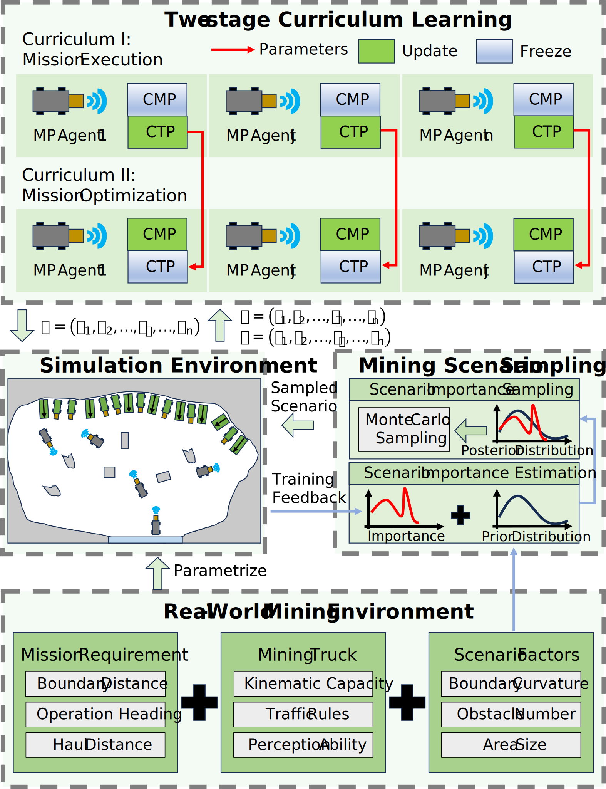

# Cooperating Mining Truck Fleets in Unstructured Mining Areas: A Co-evolutionary Motion Planner – Evaluation Videos

This repository provides **evaluation videos** for the paper:

> **“Cooperating Mining Truck Fleets in Unstructured Mining Areas: A Co-evolutionary Motion Planner”**  
> Wenze Luo, Zhen Zhang, Jintao Lai, Linbo Li, Tongji University.

https://github.com/user-attachments/assets/08b758e6-502b-4dbd-b02c-d015b68c097e

The proposed **Co-evolutionary Motion Planner** integrates **Cooperative Mission Planning (CMP)** and **Cooperative Trajectory Planning (CTP)** in a unified multi-agent reinforcement learning framework. It aims to:
- Improve fleet-level operational efficiency;
- Better balance the interests of multiple Autonomous Mining Trucks (AMTs);
- Enhance robustness under diverse unstructured mining layouts.

---

## Contents

The videos in this repository illustrate several groups of experiments, including but not limited to:

- **Functional validation**  
  - Multi-AMT coordination at both mission and trajectory levels.  
  - Comparison with non-cooperative, mission-cooperative, and trajectory-cooperative planners.

- **Operational efficiency improvement**  
  - Changes in success rate and average operation time under different fleet sizes.  
  - Typical cases showing how co-evolutionary planning reduces detours and waiting time.

- **Coordination of AMTs’ interests**  
  - Examples where the proposed planner achieves lower inter-truck conflict rates.  
  - More balanced task durations across trucks (reduced degree of interest conflict).

- **Operational robustness in diverse scenarios**  
  - Scenarios with different obstacle densities and boundary curvatures.  
  - Cases where the planner maintains high success rates in more complex layouts.

Each video corresponds to one or more experimental settings described in the paper, and can be used as supplementary material for readers to better understand the qualitative behavior of the planner.

---

## How to Use

- Click on a video file in this repository to **preview it directly in the browser**, or download it for **offline viewing**.
- You may embed these videos in:
  - Academic presentations,
  - Classroom teaching,
  - Internal technical reports,  
  as long as proper citation is given (see below).

---

## Citation

If you find the videos or the underlying method useful in your research, please cite:

> W. Luo, Z. Zhang, J. Lai, and L. Li,  
> **“Cooperating Mining Truck Fleets in Unstructured Mining Areas: A Co-evolutionary Motion Planner.”**

A sample BibTeX entry (update the venue and year when the paper is officially published):

```bibtex
@article{luo2025coevomt,
  author  = {Wenze Luo and Haobo Zhang and Zhen Zhang and Jintao Lai and Linbo Li},
  title   = {Cooperating Mining Truck Fleets in Unstructured Mining Areas: A Co-evolutionary Motion Planner},
  journal = {to appear},
  year    = {2025}
}
